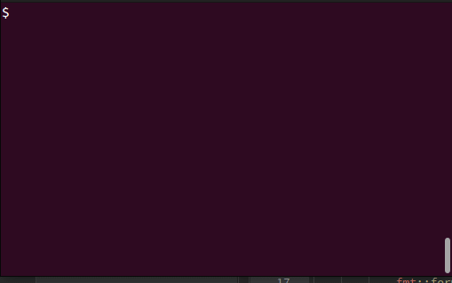

# crap


Introducing Crap - a simple and intuitive version control system that takes the
mess out of tracking your code changes

It's like git, but crap.

## Get Started in No Time
With Crap, you'll be able to master version control in no time.
Our system is built on the premise that learning should be natural
and effortless, just like the essential skills we acquire early in life.

## Powered by Cutting-Edge Technology
To ensure that Crap remains an enjoyable and efficient tool for
developers, we've harnessed the power of the latest machine learning
technology. Our commitment to innovation guarantees a seamless and pleasant 
experience for all users, even when dealing with untidy situations.


Embrace the simplicity of Crap, and never feel overwhelmed by version control again!




## Crap is the pinnacle of c++

As the creator of Git and Linux himself
[prophezised](http://harmful.cat-v.org/software/c++/linus) a crap versioning
system written in c++ was destined to come to into existence. Therefore crap
is implemented in only pure c++.


## Example crap workflow

1. Create some folder with data that you want to version control

```

mkdir test-project
cd test-project
echo hello > text.txt

```


2. Init a potty to store your preacious content

```
crap init
```

3. Dump your newly created content into the potty

```
crap dump text.txt
```

4. Look at the content of the potty to verify you managed to dump everything

```
crap look
```

5. Flush the content of the potty to the tank

```
crap flush
```

6. Rinse and repeat


So what are you waiting for? Convert your projects to crap today!


# Licence
The project is released under the GNU licence.

For some subdirectories with files from other project check their respective licence.
